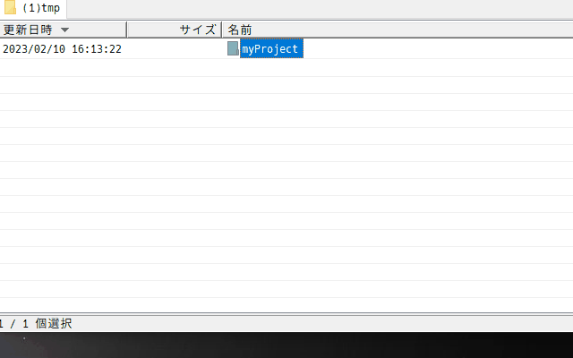

# hfc-archive

Collection of scripts for handling archives in Hidemaru Filer Classic (Windows application).  
秀丸ファイラーClassic（Windowsアプリ）でアーカイブを扱うためのスクリプト集です。

## 概要

ファイルやディレクトリの圧縮。圧縮ファイル中身の表示、展開をします。




## 機能

  - 圧縮と展開zip, 7zip, tar.gz(tgz), tar,bz2(tbz2), tar,xz(txz), tar
  - 展開のみAR, ARJ, CAB, CHM, CPIO, CramFS, DMG, EXT, FAT, GPT, HFS, IHEX, ISO, LZH, LZMA, MBR, MSI, NSIS, NTFS, QCOW2, RAR, RPM, SquashFS, UDF, UEFI, VDI, VHD, VMDK, WIM, XAR, Z
  - 圧縮時アーカイブファイル名、保存パスを変更
  - 展開時tar.* を最後まで展開
  - 展開せずにアーカイブファイルの中身を確認
  
## 必要条件

  - Windows
  - 秀丸ファイラーClassic
  - 7-Zip  22.01 or later 
  - GNU tar  1.23 or later
  - xz  5.29 or later

  ※tarは、Windowsに入っているものがxzと連携できないためインストールします。

## インストール
  - 依存ファイルのインストール  
    デフォルトでは以下を想定しています。
    ```
    chocolety install 7zip
    scoop install tar
    scoop install xz
    ```
    パスが異なる場合は、スクリプトのEXEC_7Z, EXEC_TARパスを変更します。

  - スクリプトの登録  
  スクリプトを適当なフォルダーに配置し、
  秀丸ファイラーClassicの〔ツール〕-〔ツールの整理〕で、スクリプトを登録します。  
  例）表示名　Archive  
  　　パス　js:C:\path\to\your\compress.js  
  　　キー割り当て　A + shift  

  - スクリプトの説明  
  compress.js　ファイルやディレクトリを圧縮します  
  uncompress.js　アーカイブファイルを展開します  
  viewcontents.js　アーカイブファイルの中身を表示します

## 使い方

- 圧縮  
  compress.jsを実行します。  
  カーソル位置のファイルまたはディレクトリのパスが表示されるので、パスの最後に希望フォーマットの拡張子を追加します。
  拡張子を追加しない場合はzipとなります。
  ファイル名やパスを変更することも可能ですが、既存のファイルや存在しないパスを指定することはできません。
  有効な拡張子は"zip, 7z, tar.gz, tgz, tar.bz2, tbz2, tar,xz, txz, tar"です。

- 展開  
  uncompress.jsを実行します。  
  カーソル位置のアーカイブファイルをカレントディレクトリに展開します。

- アーカイブの中身を表示  
  viewcontents.jsを実行します。  
  カーソル位置のアーカイブファイルの内容を表示します。

## 作者

  - Takeshi Aoki  https://bit.ly/aotakejp  https://github.com/aotakejp

## ライセンス

  - [MIT](http://www.opensource.org/licenses/mit-license.html) 